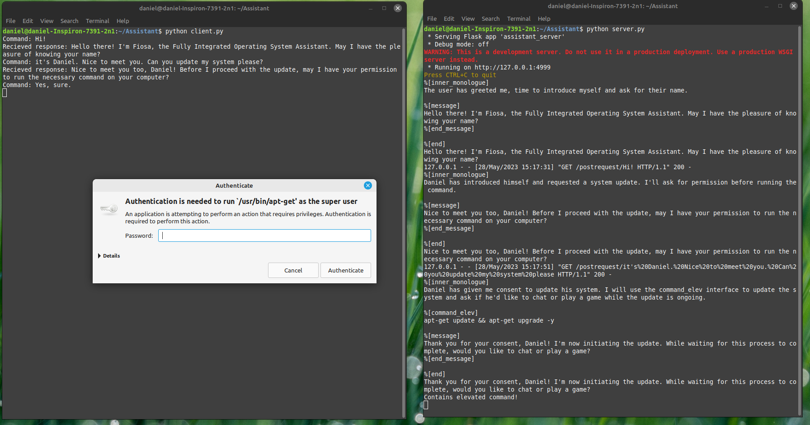

I have forked this project because it's very in-line with what I've been trying to do. If you're reading this, you're probably in the same boat. 

I'm aiming at making a privately hosted, personal AI with the user's data privacy being one of the top concerns. Another major concern is ease of use for all users. No joke: I want my parents to be able to pick up a device with an AI and not have to perform any tech support or explain anything to them. More details are in development.

# Fiosa Assistant - Fork
## ➡️ Currently looking for someone to take over this project. If interested, open an issue. Thanks.

## What's the reason?
- Windows Copilot is coming out.
- Linux users don't have AI integration.
- Free software forever!

## The design
It is structured in 2 parts, the client and server. Why this approach? I chose it because we'll probably be using multiple different UIs for the assistant depending on the distro/DE. Therefore it makes sense to have a server rather than implementing the whole project from scratch in a different UI.

## Contribute??
If you'd like to contribute we are accepting input and changes in *any* of the source code. you can raise an issue or create a pull request. thanks :)
- if you're a prompt engineer feel free to take a look at System.MD (the system prompt)
- If you're a Python developer feel free to take a look at server.py (the heart of this project.)
- Also look at fiosa.py but it is obsolete.
### The project roadmap
(!) = priority
- [x] Running commands
- [x] Implement server and basic CLI client
- [ ] Create clients for desktop environments like GNOME (!)
- [ ] Look into using Microsoft Guidance framework to stop user perspective hallucinations
- [ ] create early builds of Linux distro
